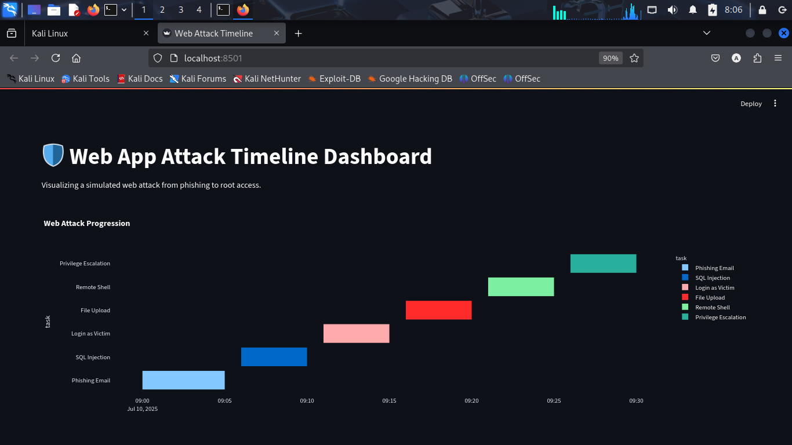
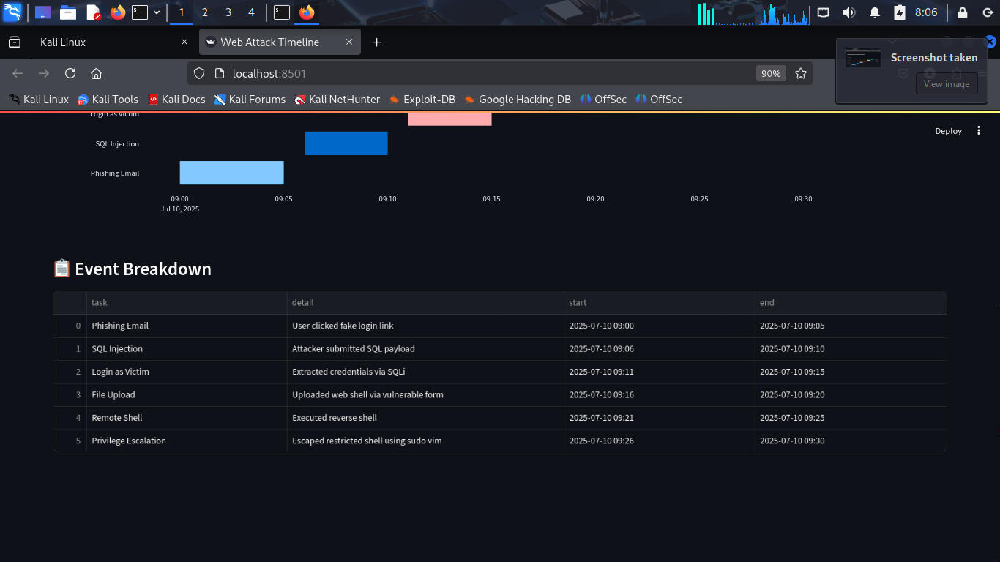

# 🛡️ Web App Attack Timeline Dashboard

This is a simple and educational dashboard that shows how a real-life web application attack happens step-by-step — from phishing to privilege escalation.

---

## 🔧 Technologies Used

- Python 🐍  
- Streamlit (for the web app)  
- Plotly (for the timeline chart)  
- JSON (to store the attack stages)

---
## 🤖 AI Touch – Threat Detection

An AI logic layer is built into the app to **automatically label each attack step** with a risk score using simple NLP rules.

For example:
- If the detail mentions “SQL”, it flags as **High Threat**
- If it includes “upload”, it flags as **Medium**
- Others default to **Low**

This makes the dashboard smarter and more insightful — especially for beginners and incident responders.


## 🧠 What This Project Does

This dashboard simulates how a web application gets hacked in real life — stage by stage — using timeline visualization.

It includes an **AI-powered threat classifier** that detects and labels each event with a **threat level** (High, Medium, Low) based on the log description.

### ✅ Attack Stages Visualized:
1. Phishing Email – Fake login page to steal credentials  
2. SQL Injection – Extract usernames and passwords from database  
3. Login as Victim – Attacker logs in with stolen data  
4. File Upload – Uploads a malicious file (web shell)  
5. Remote Shell – Gains shell access to server  
6. Privilege Escalation – Gains root access using system weakness


Each step is shown on a **colorful timeline**, so beginners can easily follow the attack flow.

---

## 💡 Why This Matters

> Web apps are not hacked in just one step — it's a **chain of small vulnerabilities**. This dashboard helps people understand how those attacks happen in sequence.

---

## 🚀 Submission Info

This project was created by **Taiwo Samson**, a 3MTT cybersecurity student, for the **3MTT July Knowledge Showcase** under the **General Learning** category.

---

## 📷 Screenshots

Here’s what the dashboard looks like:

### 🟦 Timeline View


### 📋 Event Table View



---

## 📦 How to Run This Project

```bash
git clone https://github.com/Taiwo-Akinmosin/WebAttackTimeline.git
cd WebAttackTimeline
python3 -m venv venv
source venv/bin/activate
pip install -r requirements.txt
streamlit run app.py

